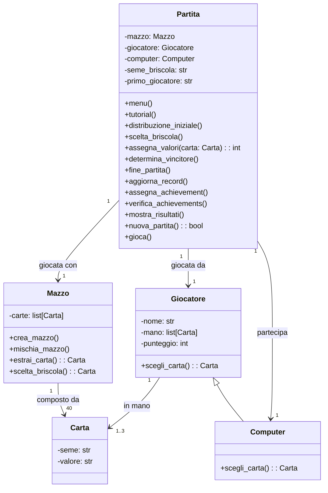

```mermaid
classDiagram
    class Carta {
        -seme: str
        -valore: str
    }

    class Mazzo {
        -carte: list[Carta]
        +crea_mazzo()
        +mischia_mazzo()
        +estrai_carta(): Carta
        +scelta_briscola(): Carta
    }

    class Giocatore {
        -nome: str
        -mano: list[Carta]
        -punteggio: int
        +scegli_carta(): Carta
    }

    class Computer {
        +scegli_carta(): Carta
    }

    class Partita {
        -mazzo: Mazzo
        -giocatore: Giocatore
        -computer: Computer
        -seme_briscola: str
        -primo_giocatore: str
        +menu()
        +tutorial()
        +distribuzione_iniziale()
        +scelta_briscola()
        +assegna_valori(carta: Carta): int
        +determina_vincitore()
        +fine_partita()
        +aggiorna_record()
        +assegna_achievement()
        +verifica_achievements()
        +mostra_risultati()
        +nuova_partita(): bool
        +gioca()
    }

    Giocatore <|-- Computer
    Partita "1"--> "1" Mazzo: giocata con
    Partita "1"--> "1" Giocatore: giocata da
    Partita "1"--> "1" Computer: partecipa
    Mazzo "1"--> "40" Carta: composto da
    Giocatore "1"--> "1..3" Carta: in mano
```